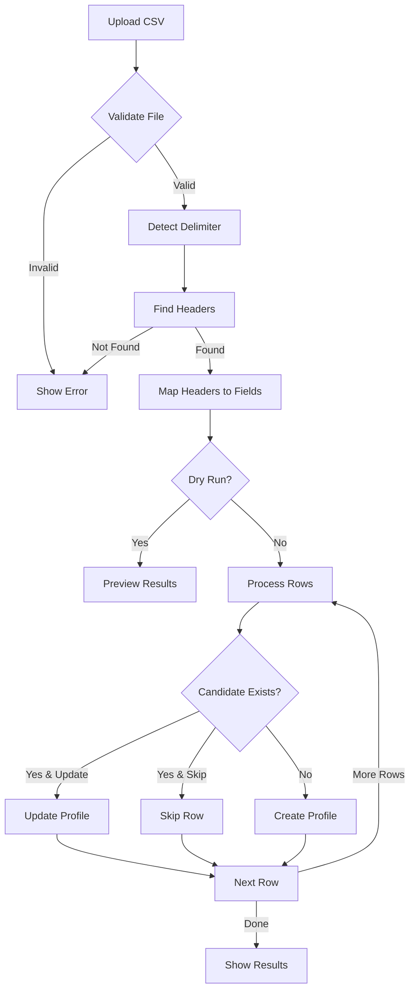

# Import System Complete Guide

## Overview
The Mobility Trailblazers platform includes two import systems and several utility tools for managing candidate profiles.

## Import Systems

### 1. Basic Import/Export (`import-export.php`)
**Location**: `templates/admin/import-export.php`
**Purpose**: General data backup and restore

#### Features:
- Export candidates to CSV (basic fields)
- Export evaluations with scores
- Import candidates from CSV
- Clear evaluations and assignments

#### CSV Format:
```csv
ID,Name,Biography,Category,Status
1,Dr. Maria Beispiel,Bio text here,Start-ups,publish
```

### 2. Enhanced Profile Import (`import-profiles.php`)
**Location**: `templates/admin/import-profiles.php`
**Class**: `includes/admin/class-mt-enhanced-profile-importer.php`
**Purpose**: Comprehensive candidate profile import with validation

#### Features:
- Dry run mode (preview before import)
- Detailed error reporting with row numbers
- Support for extended fields
- UTF-8 and BOM handling
- Multiple delimiter support (comma, semicolon, tab)
- Update existing profiles
- Photo import capabilities

#### Supported Fields:
- **Required**: Name
- **Optional**: 
  - ID (unique identifier)
  - Position (job title)
  - Organisation (company name)
  - Category (award category, comma-separated for multiple)
  - Top 50 (Yes/No or Ja/Nein)
  - Nominator
  - LinkedIn-Link
  - Webseite
  - Foto (Ja/Yes or URL)
  - Description (full text with evaluation criteria)
  - Erste Notizen/Nachricht (notes)

#### CSV Example:
```csv
ID,Name,Position,Organisation,Category,Top 50,Nominator,LinkedIn-Link,Webseite,Foto,Description
1,Dr. Maria Schneider,CEO,Urban Mobility GmbH,Start-ups,Ja,Thomas Weber,https://linkedin.com/in/mariaschneider,https://urban-mobility.de,Ja,Full description text...
```

## Recent Fixes (August 2025)

### Import System Fixes

#### 1. File Type Validation Enhancement
**File**: `class-mt-enhanced-profile-importer.php`
**Changes**:
- Added support for more MIME types including `application/vnd.ms-excel` and `application/octet-stream`
- Made validation warnings instead of hard errors
- Added support for files without extensions (temp files)

```php
$allowed_mimes = ['text/csv', 'text/plain', 'application/csv', 'application/x-csv', 
                  'application/vnd.ms-excel', 'text/x-csv', 'text/comma-separated-values', 
                  'application/octet-stream'];
```

#### 2. Header Detection Improvements
**Changes**:
- Made header detection case-insensitive
- Increased row scanning from 10 to 20 rows
- Better handling of empty rows
- Improved detection logic for ID and Name columns

```php
// Case-insensitive header detection
foreach ($data as $cell) {
    $cell_lower = strtolower(trim($cell));
    if ($cell_lower === 'id' || $cell_lower === 'nummer') {
        $has_id = true;
    }
    if ($cell_lower === 'name' || strpos($cell_lower, 'name') !== false) {
        $has_name = true;
    }
}
```

#### 3. Delimiter Detection Algorithm
**Enhancement**: Multi-line analysis with consistency checking
```php
// Analyzes multiple lines for consistent delimiter pattern
// Considers both count and variance across lines
// Supports: comma (,), semicolon (;), tab (\t), pipe (|)
```

#### 4. UTF-8 BOM Handling
**Purpose**: Properly handle files saved from Excel with Byte Order Mark
```php
$bom = file_get_contents($file_path, false, null, 0, 3);
$has_bom = ($bom === "\xEF\xBB\xBF");
if ($has_bom) {
    fread($handle, 3); // Skip BOM
}
```

#### 5. WordPress Compatibility Update
**Change**: Replaced deprecated `get_page_by_title()` with `WP_Query`
```php
$existing_query = new \WP_Query([
    'post_type' => 'mt_candidate',
    'title' => $data['name'],
    'posts_per_page' => 1,
    'post_status' => 'any'
]);
```

## Debug Tools

### 1. Migrate Profiles Tool
**Location**: `debug/migrate-candidate-profiles.php`
**Access**: Admin Menu > Mobility Trailblazers > Migrate Profiles
**Purpose**: Ensure existing profiles have correct meta field structure

#### Features:
- Shows current statistics
- Updates meta field structure
- Preserves existing data
- Batch processing of all candidates

### 2. Test Profile System
**Location**: `debug/test-profile-system.php`
**Access**: Admin Menu > Mobility Trailblazers > Test Profile System
**Purpose**: Debug and verify profile system functionality

#### Test Types:
- **Meta Fields Test**: Checks all meta fields on a random candidate
- **Taxonomy Test**: Lists all categories and their usage
- **Create Test**: Creates a test candidate with all fields

### 3. Generate Sample Profiles
**Location**: `debug/generate-sample-profiles.php`
**Access**: Admin Menu > Mobility Trailblazers > Generate Samples
**Purpose**: Create test data for development

#### Features:
- Generate 1-50 profiles at once
- Random German names and organizations
- Assigns to categories
- Creates as drafts (not public)
- Includes all meta fields

## Meta Field Structure

### Candidate Meta Fields
All candidate profiles use these meta keys:

| Meta Key | Purpose | Example |
|----------|---------|---------|
| `_mt_display_name` | Display name | Dr. Maria Schneider |
| `_mt_organization` | Company/Organization | Urban Mobility GmbH |
| `_mt_position` | Job title | CEO & Founder |
| `_mt_linkedin` | LinkedIn URL | https://linkedin.com/in/mariaschneider |
| `_mt_website` | Website URL | https://urban-mobility.de |
| `_mt_email` | Email address | maria@urban-mobility.de |
| `_mt_top50` | Top 50 status | yes/no |
| `_mt_nominator` | Who nominated | Thomas Weber |
| `_mt_notes` | Internal notes | First contact notes |
| `_mt_courage` | Courage criterion text | Shows exceptional courage... |
| `_mt_innovation` | Innovation criterion | Innovative approaches... |
| `_mt_implementation` | Implementation criterion | Successful implementation... |
| `_mt_relevance` | Relevance criterion | High relevance for mobility... |
| `_mt_visibility` | Visibility criterion | Visible role model... |
| `_mt_personality` | Personality criterion | Strong personality... |

## Import Process Flow



## Troubleshooting

### Common Issues and Solutions

#### 1. "Wrong format" Error
**Causes**:
- File MIME type not recognized
- No valid headers found
- File encoding issues

**Solutions**:
- Save CSV as UTF-8
- Ensure first row has headers
- Use comma or semicolon as delimiter
- Try removing special characters from headers

#### 2. No Data Imported
**Causes**:
- Headers not matching expected format
- Empty Name column
- Encoding issues

**Solutions**:
- Check header names match documentation
- Ensure Name column has values
- Save file as UTF-8 without BOM

#### 3. Special Characters Display Wrong
**Cause**: Character encoding mismatch
**Solution**: Save CSV as UTF-8 encoding

#### 4. Categories Not Assigned
**Cause**: Category names don't match existing terms
**Solution**: Categories are created automatically if they don't exist

## Best Practices

### For CSV Preparation
1. Use UTF-8 encoding
2. Include header row as first row
3. Use consistent delimiter throughout
4. Wrap multi-line text in quotes
5. Test with dry run first

### For Large Imports
1. Split into batches of 100-200 candidates
2. Run dry run to validate data
3. Monitor import progress
4. Check error logs for issues
5. Backup database before large imports

### For Data Quality
1. Standardize organization names
2. Validate URLs before import
3. Use consistent category names
4. Include evaluation criteria in description
5. Mark Top 50 candidates appropriately

## API Reference

### Import Method
```php
use MobilityTrailblazers\Admin\MT_Enhanced_Profile_Importer;

$results = MT_Enhanced_Profile_Importer::import_csv($file_path, [
    'update_existing' => true,
    'skip_empty_fields' => false,
    'validate_urls' => true,
    'import_photos' => true,
    'dry_run' => false
]);
```

### Return Structure
```php
[
    'success' => 10,        // Successfully created
    'updated' => 5,         // Successfully updated
    'skipped' => 2,         // Skipped (already exists)
    'errors' => 1,          // Failed imports
    'messages' => [...],    // Detailed messages
    'imported_ids' => [...], // Post IDs of imported candidates
    'error_details' => [    // Detailed error information
        [
            'row' => 5,
            'name' => 'John Doe',
            'error' => 'Invalid email format'
        ]
    ]
]
```

## Version History

### Version 2.2.0 (August 2025)
- Enhanced profile import system
- Debug tools added
- UTF-8 BOM handling
- Improved delimiter detection
- Case-insensitive header matching
- Deprecated function replacements

### Version 2.0.0
- Basic import/export functionality
- CSV export for candidates and evaluations
- Simple import validation

## Security Considerations

1. **File Upload Security**:
   - MIME type validation
   - File size limits (10MB max)
   - File extension validation

2. **Data Sanitization**:
   - All input sanitized using WordPress functions
   - URLs validated before storage
   - HTML stripped from most fields
   - `wp_kses_post()` for description field

3. **Permissions**:
   - Requires `mt_import_data` capability
   - Admin-only access to debug tools
   - Nonce verification on all forms

## Support

For issues or questions about the import system:
1. Check error messages in import results
2. Review this documentation
3. Use Test Profile System to verify setup
4. Check error logs at Admin > Mobility Trailblazers > Error Monitor
