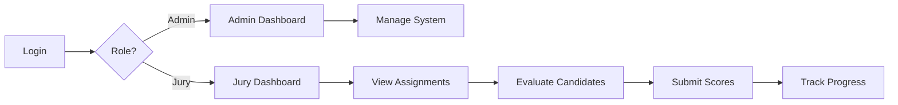

# Mobility Trailblazers - System Overview Specification

**Version:** 1.0.0  
**Last Updated:** 2025-01-22  
**Status:** Complete

## Table of Contents
1. [Executive Summary](#executive-summary)
2. [Business Objectives](#business-objectives)
3. [System Scope](#system-scope)
4. [Technology Stack](#technology-stack)
5. [Architecture Overview](#architecture-overview)
6. [Key Features](#key-features)
7. [User Roles](#user-roles)
8. [Timeline & Milestones](#timeline--milestones)
9. [Success Metrics](#success-metrics)

## Executive Summary

The Mobility Trailblazers platform is an enterprise-grade WordPress plugin designed to manage a comprehensive award evaluation system for recognizing mobility innovators in the DACH (Germany, Austria, Switzerland) region. The system handles the complete lifecycle from candidate import through jury evaluation to final award selection.

### Key Statistics
- **Candidates:** 490+ mobility innovators
- **Jury Members:** 24+ industry experts
- **Categories:** 3 (Startups, Established Companies, Governance & Administration)
- **Evaluation Criteria:** 5 weighted criteria
- **Platform Version:** 2.5.38
- **Target Audience:** DACH region mobility sector

## Business Objectives

### Primary Goals
1. **Recognize Innovation**: Identify and award leading mobility innovators in the DACH region
2. **Fair Evaluation**: Provide transparent, unbiased evaluation through structured jury process
3. **Industry Impact**: Showcase innovations driving the mobility transformation
4. **Regional Focus**: Strengthen DACH region's position in global mobility innovation

### Success Criteria
- Complete evaluation of all candidates by jury deadline
- Minimum 3 jury evaluations per candidate
- 100% jury participation in evaluation process
- Successful award ceremony on October 30, 2025

## System Scope

### In Scope
- **Candidate Management**: Import, categorize, and manage 490+ candidate profiles
- **Jury System**: Assignment and evaluation workflow for 24+ jury members
- **Evaluation Framework**: 5-criteria scoring system with weighted calculations
- **Import/Export**: Excel/CSV import with German text parsing
- **Reporting**: Rankings, statistics, and export capabilities
- **Multi-language**: Full German localization for DACH market

### Out of Scope
- Public voting system (jury-only evaluation)
- Payment processing
- Email marketing campaigns
- Social media integration
- Mobile applications

## Technology Stack

### Core Requirements
```yaml
WordPress:
  minimum: 5.8
  recommended: 6.4+
  multisite: supported

PHP:
  minimum: 7.4
  recommended: 8.1+
  extensions: 
    - mysqli
    - mbstring
    - json
    - dom

MySQL/MariaDB:
  minimum: 5.7 / 10.3
  recommended: 8.0 / 10.6+
  charset: utf8mb4
  collation: utf8mb4_unicode_ci

Server:
  web_server: Apache 2.4+ / Nginx 1.18+
  memory_limit: 256M minimum
  max_execution_time: 300 seconds
  upload_max_filesize: 10M
```

### Development Stack
```yaml
Frontend:
  css: CSS3 with custom properties
  javascript: ES6+ (transpiled for compatibility)
  libraries:
    - jQuery 3.6+ (WordPress bundled)
    - Select2 4.1+ (enhanced dropdowns)

Backend:
  architecture: MVC with dependency injection
  patterns:
    - Repository pattern
    - Service layer
    - Dependency injection container
    - PSR-4 autoloading

Build Tools:
  asset_minification: Production builds
  css_preprocessing: CSS custom properties
  javascript_bundling: Concatenation
```

### Third-Party Integrations
- **Elementor**: Optional page builder widgets
- **PhpSpreadsheet**: Excel file processing
- **WP-CLI**: Command-line management

## Architecture Overview

### High-Level Architecture
```
┌─────────────────────────────────────────────────────┐
│                 Presentation Layer                  │
│  • Admin Dashboard  • Jury Interface  • Templates   │
├─────────────────────────────────────────────────────┤
│                    Service Layer                    │
│  • Business Logic  • Validation  • Workflows        │
├─────────────────────────────────────────────────────┤
│                  Repository Layer                   │
│  • Data Access  • Query Building  • Caching         │
├─────────────────────────────────────────────────────┤
│                    Data Layer                       │
│  • WordPress DB  • Custom Tables  • File Storage    │
└─────────────────────────────────────────────────────┘
```

### Component Architecture
```yaml
Plugin Structure:
  mobility-trailblazers/
    ├── includes/           # PHP classes
    │   ├── core/          # Core functionality
    │   ├── admin/         # Admin interfaces
    │   ├── ajax/          # AJAX handlers
    │   ├── services/      # Business logic
    │   ├── repositories/  # Data access
    │   └── interfaces/    # Contracts
    ├── templates/         # View templates
    ├── assets/           # CSS/JS/Images
    ├── languages/        # Translations
    └── doc/              # Documentation
```

## Key Features

### 1. Candidate Management
- **Import System**: Excel/CSV with German text parsing
- **Profile Management**: Rich profiles with 5 evaluation criteria
- **Photo Management**: Automatic attachment and display
- **Categorization**: 3 distinct award categories
- **Metadata**: Organization, position, LinkedIn, website

### 2. Jury Evaluation System
- **Assignment Engine**: Balanced distribution algorithm
- **Evaluation Interface**: Intuitive scoring interface
- **Progress Tracking**: Real-time completion monitoring
- **Draft/Final States**: Save progress before submission
- **Conflict Prevention**: No duplicate evaluations

### 3. Scoring Framework
```yaml
Evaluation Criteria:
  - courage_and_pioneering: "Mut & Pioniergeist"
  - innovation_level: "Innovationsgrad"
  - implementation_strength: "Umsetzungsstärke"
  - relevance_impact: "Relevanz & Impact"
  - visibility_reach: "Sichtbarkeit & Reichweite"

Scoring:
  scale: 0-10 (0.5 increments)
  calculation: average of 5 criteria
  ranking: average of all jury scores
```

### 4. Admin Management
- **Dashboard**: Comprehensive oversight interface
- **Assignment Manager**: Manual and automatic assignment
- **Progress Monitor**: Track evaluation completion
- **Export System**: Generate reports and exports
- **Debug Center**: System health monitoring

### 5. Security Features
- **Role-Based Access**: Granular permissions
- **AJAX Security**: Nonce verification
- **Input Validation**: Comprehensive sanitization
- **Audit Logging**: Complete activity tracking
- **SQL Protection**: Prepared statements

## User Roles

### System Roles
```yaml
Administrator:
  capabilities: Full system access
  responsibilities:
    - System configuration
    - User management
    - Data import/export
    - Award selection

Jury Admin:
  capabilities: Jury management
  responsibilities:
    - Assignment management
    - Progress monitoring
    - Report generation
    - Evaluation oversight

Jury Member:
  capabilities: Evaluation submission
  responsibilities:
    - Review assigned candidates
    - Submit evaluations
    - Track own progress
```

### User Journey


## Timeline & Milestones

### Project Timeline
```yaml
2025_Q1:
  January:
    - System deployment
    - Jury onboarding
  February:
    - Candidate import
    - Assignment distribution
  March:
    - Evaluation period begins

2025_Q2:
  April-June:
    - Ongoing evaluations
    - Progress monitoring

2025_Q3:
  July:
    - Evaluation deadline
  August:
    - Platform launch: August 18, 2025
    - Final rankings
  September:
    - Winner selection

2025_Q4:
  October:
    - Award ceremony: October 30, 2025
    - Public announcement
```

### Critical Dates
- **Platform Launch**: August 18, 2025
- **Award Ceremony**: October 30, 2025
- **Evaluation Deadline**: July 31, 2025

## Success Metrics

### Quantitative Metrics
```yaml
Participation:
  jury_completion_rate: ≥95%
  candidates_evaluated: 100%
  evaluations_per_candidate: ≥3

Performance:
  page_load_time: <2 seconds
  import_success_rate: >99%
  system_uptime: 99.9%

Quality:
  evaluation_consistency: <10% variance
  data_accuracy: 100%
  security_incidents: 0
```

### Qualitative Metrics
- Jury member satisfaction
- Ease of use feedback
- Award credibility
- Industry recognition
- Media coverage

## System Requirements Summary

### Minimum Requirements
- WordPress 5.8+
- PHP 7.4+
- MySQL 5.7+
- 256MB RAM
- 1GB storage

### Recommended Configuration
- WordPress 6.4+
- PHP 8.1+
- MySQL 8.0+
- 512MB RAM
- 2GB storage
- SSL certificate
- CDN for assets

## Implementation Phases

### Phase 1: Foundation (Weeks 1-2)
- Core plugin structure
- Database schema
- User roles and permissions
- Basic admin interface

### Phase 2: Core Features (Weeks 3-6)
- Candidate management
- Jury evaluation system
- Import/export functionality
- AJAX infrastructure

### Phase 3: Enhanced Features (Weeks 7-8)
- Auto-assignment algorithm
- Progress tracking
- Reporting system
- Debug center

### Phase 4: Polish & Deploy (Weeks 9-10)
- German localization
- Performance optimization
- Security hardening
- Documentation
- Testing & deployment

## Conclusion

The Mobility Trailblazers platform represents a comprehensive solution for managing awards in the mobility innovation sector. With its robust architecture, security-first approach, and user-friendly interfaces, it provides all necessary tools for successful award management while maintaining flexibility for future enhancements.

---

**Next Document**: [02-database-architecture.md](02-database-architecture.md) - Complete database schema and data model specifications