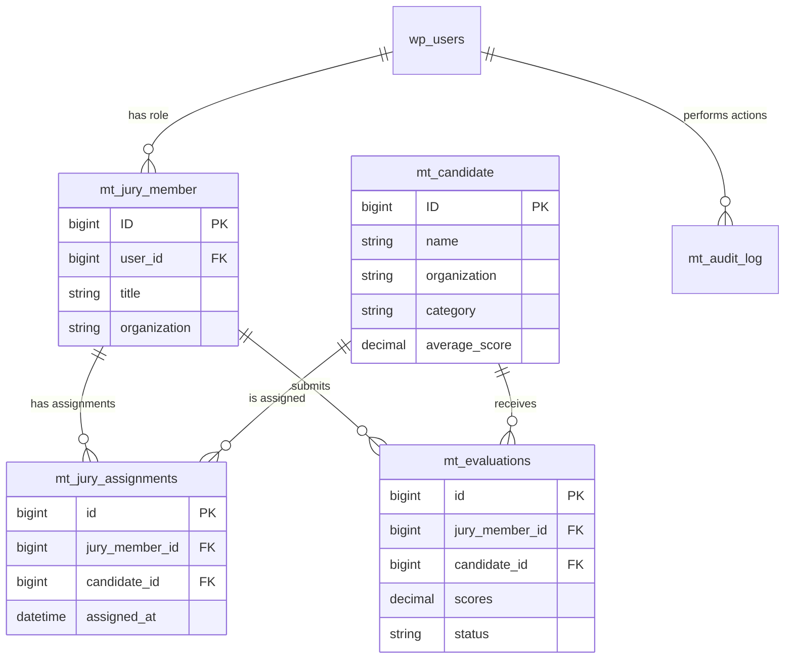

# Mobility Trailblazers - Database Architecture Specification

**Version:** 1.0.0  
**Last Updated:** 2025-01-22  
**Status:** Complete

## Table of Contents
1. [Overview](#overview)
2. [Database Schema](#database-schema)
3. [Custom Tables](#custom-tables)
4. [WordPress Tables Integration](#wordpress-tables-integration)
5. [Custom Post Types](#custom-post-types)
6. [Meta Fields](#meta-fields)
7. [Relationships](#relationships)
8. [Indexes & Performance](#indexes--performance)
9. [Migration System](#migration-system)
10. [Data Integrity](#data-integrity)

## Overview

The Mobility Trailblazers plugin extends WordPress's database architecture with custom tables for evaluation management while leveraging WordPress's built-in post system for content management.

### Database Design Principles
- **Normalization**: 3rd normal form for data integrity
- **Performance**: Strategic indexes for query optimization
- **Scalability**: Designed for 1000+ candidates, 100+ jury members
- **Compatibility**: WordPress database API compliance
- **Security**: Prepared statements and sanitization

## Database Schema

### Schema Overview
```sql
-- WordPress Core Tables (Used)
wp_posts          -- Candidates and jury members
wp_postmeta       -- Extended properties
wp_users          -- User accounts
wp_usermeta       -- User preferences
wp_terms          -- Categories
wp_term_taxonomy -- Category relationships
wp_options        -- Plugin settings

-- Custom Plugin Tables
wp_mt_evaluations       -- Jury evaluations
wp_mt_jury_assignments  -- Jury-candidate mappings
wp_mt_audit_log        -- Activity tracking
```

## Custom Tables

### Table: wp_mt_evaluations

**Purpose**: Store jury member evaluations of candidates

```sql
CREATE TABLE `wp_mt_evaluations` (
  `id` bigint(20) unsigned NOT NULL AUTO_INCREMENT,
  `jury_member_id` bigint(20) unsigned NOT NULL,
  `candidate_id` bigint(20) unsigned NOT NULL,
  `courage_score` tinyint(2) unsigned NOT NULL DEFAULT 0,
  `innovation_score` tinyint(2) unsigned NOT NULL DEFAULT 0,
  `implementation_score` tinyint(2) unsigned NOT NULL DEFAULT 0,
  `relevance_score` tinyint(2) unsigned NOT NULL DEFAULT 0,
  `visibility_score` tinyint(2) unsigned NOT NULL DEFAULT 0,
  `total_score` decimal(5,2) NOT NULL DEFAULT 0.00,
  `comments` longtext COLLATE utf8mb4_unicode_ci,
  `status` varchar(20) COLLATE utf8mb4_unicode_ci NOT NULL DEFAULT 'draft',
  `created_at` datetime DEFAULT CURRENT_TIMESTAMP,
  `updated_at` datetime DEFAULT CURRENT_TIMESTAMP ON UPDATE CURRENT_TIMESTAMP,
  `submitted_at` datetime DEFAULT NULL,
  PRIMARY KEY (`id`),
  UNIQUE KEY `unique_evaluation` (`jury_member_id`,`candidate_id`),
  KEY `idx_candidate` (`candidate_id`),
  KEY `idx_jury_member` (`jury_member_id`),
  KEY `idx_status` (`status`),
  KEY `idx_total_score` (`total_score`),
  KEY `idx_updated` (`updated_at`)
) ENGINE=InnoDB DEFAULT CHARSET=utf8mb4 COLLATE=utf8mb4_unicode_ci;
```

**Field Specifications**:
| Field | Type | Description | Constraints |
|-------|------|-------------|-------------|
| id | BIGINT | Primary key | AUTO_INCREMENT |
| jury_member_id | BIGINT | References wp_posts.ID | NOT NULL, FK |
| candidate_id | BIGINT | References wp_posts.ID | NOT NULL, FK |
| courage_score | TINYINT | Score 0-10 (stored as 0-20 for 0.5 increments) | 0-20 |
| innovation_score | TINYINT | Score 0-10 | 0-20 |
| implementation_score | TINYINT | Score 0-10 | 0-20 |
| relevance_score | TINYINT | Score 0-10 | 0-20 |
| visibility_score | TINYINT | Score 0-10 | 0-20 |
| total_score | DECIMAL(5,2) | Calculated average | 0.00-10.00 |
| comments | LONGTEXT | Optional feedback | NULL allowed |
| status | VARCHAR(20) | draft/completed/submitted | Enum-like |
| created_at | DATETIME | Creation timestamp | DEFAULT NOW |
| updated_at | DATETIME | Last update | ON UPDATE |
| submitted_at | DATETIME | Final submission time | NULL until submitted |

### Table: wp_mt_jury_assignments

**Purpose**: Track which candidates are assigned to which jury members

```sql
CREATE TABLE `wp_mt_jury_assignments` (
  `id` bigint(20) unsigned NOT NULL AUTO_INCREMENT,
  `jury_member_id` bigint(20) unsigned NOT NULL,
  `candidate_id` bigint(20) unsigned NOT NULL,
  `assigned_at` datetime DEFAULT CURRENT_TIMESTAMP,
  `assigned_by` bigint(20) unsigned DEFAULT NULL,
  `assignment_method` varchar(20) DEFAULT 'manual',
  `priority` tinyint(1) DEFAULT 0,
  PRIMARY KEY (`id`),
  UNIQUE KEY `unique_assignment` (`jury_member_id`,`candidate_id`),
  KEY `idx_jury_member` (`jury_member_id`),
  KEY `idx_candidate` (`candidate_id`),
  KEY `idx_assigned_at` (`assigned_at`),
  KEY `idx_assigned_by` (`assigned_by`)
) ENGINE=InnoDB DEFAULT CHARSET=utf8mb4 COLLATE=utf8mb4_unicode_ci;
```

**Field Specifications**:
| Field | Type | Description | Constraints |
|-------|------|-------------|-------------|
| id | BIGINT | Primary key | AUTO_INCREMENT |
| jury_member_id | BIGINT | Jury member post ID | NOT NULL, FK |
| candidate_id | BIGINT | Candidate post ID | NOT NULL, FK |
| assigned_at | DATETIME | Assignment timestamp | DEFAULT NOW |
| assigned_by | BIGINT | Admin user ID | NULL allowed |
| assignment_method | VARCHAR(20) | manual/auto/balanced | DEFAULT 'manual' |
| priority | TINYINT | Assignment priority | 0-9 |

### Table: wp_mt_audit_log

**Purpose**: Track all significant system actions for security and compliance

```sql
CREATE TABLE `wp_mt_audit_log` (
  `id` bigint(20) unsigned NOT NULL AUTO_INCREMENT,
  `user_id` bigint(20) unsigned NOT NULL,
  `action` varchar(255) COLLATE utf8mb4_unicode_ci NOT NULL,
  `object_type` varchar(100) COLLATE utf8mb4_unicode_ci NOT NULL,
  `object_id` bigint(20) unsigned NOT NULL,
  `details` longtext COLLATE utf8mb4_unicode_ci,
  `ip_address` varchar(45) DEFAULT NULL,
  `user_agent` varchar(255) DEFAULT NULL,
  `created_at` datetime DEFAULT CURRENT_TIMESTAMP,
  PRIMARY KEY (`id`),
  KEY `idx_user_id` (`user_id`),
  KEY `idx_action` (`action`),
  KEY `idx_object` (`object_type`,`object_id`),
  KEY `idx_created_at` (`created_at`)
) ENGINE=InnoDB DEFAULT CHARSET=utf8mb4 COLLATE=utf8mb4_unicode_ci;
```

**Field Specifications**:
| Field | Type | Description | Constraints |
|-------|------|-------------|-------------|
| id | BIGINT | Primary key | AUTO_INCREMENT |
| user_id | BIGINT | WordPress user ID | NOT NULL |
| action | VARCHAR(255) | Action performed | NOT NULL |
| object_type | VARCHAR(100) | Entity type | NOT NULL |
| object_id | BIGINT | Entity ID | NOT NULL |
| details | LONGTEXT | JSON action details | NULL allowed |
| ip_address | VARCHAR(45) | IPv4/IPv6 address | NULL allowed |
| user_agent | VARCHAR(255) | Browser info | NULL allowed |
| created_at | DATETIME | Action timestamp | DEFAULT NOW |

## WordPress Tables Integration

### wp_posts Integration

**Custom Post Types**:
```php
// Candidate Post Type
post_type: 'mt_candidate'
post_status: 'publish' (visible) | 'draft' (hidden)
post_title: Candidate name
post_content: Full description
post_excerpt: Short bio

// Jury Member Post Type  
post_type: 'mt_jury_member'
post_status: 'publish' (active) | 'draft' (inactive)
post_title: Jury member name
post_content: Biography
```

### wp_postmeta Integration

**Candidate Meta Fields**:
```php
// Professional Information
'_mt_organization'        => 'Company/Institution name'
'_mt_position'            => 'Job title/role'
'_mt_expertise'           => 'Area of expertise'

// Contact & Links
'_mt_email'               => 'Contact email'
'_mt_linkedin_url'        => 'LinkedIn profile URL'
'_mt_website_url'         => 'Personal/company website'
'_mt_article_url'         => 'Featured article URL'

// Categorization
'_mt_category_type'       => 'Startup|Tech|Gov'
'_mt_top_50_status'       => 'yes|no'
'_mt_award_year'          => '2025'

// Evaluation Criteria (German)
'_mt_criterion_courage'       => 'Mut & Pioniergeist text'
'_mt_criterion_innovation'    => 'Innovationsgrad text'
'_mt_criterion_implementation'=> 'Umsetzungsstärke text'
'_mt_criterion_relevance'     => 'Relevanz & Impact text'
'_mt_criterion_visibility'    => 'Sichtbarkeit & Reichweite text'

// Scoring Cache
'_mt_average_score'       => 'Calculated average (cached)'
'_mt_evaluation_count'    => 'Number of evaluations'
'_mt_last_evaluated'      => 'Last evaluation timestamp'
```

**Jury Member Meta Fields**:
```php
// User Association
'_mt_user_id'             => 'WordPress user ID'

// Professional Information
'_mt_organization'        => 'Company/Institution'
'_mt_title'              => 'Professional title'
'_mt_expertise'          => 'Areas of expertise'

// Assignment Preferences
'_mt_max_assignments'     => 'Maximum candidates to evaluate'
'_mt_preferred_categories'=> 'Preferred evaluation categories'

// Statistics
'_mt_evaluations_completed' => 'Number completed'
'_mt_evaluations_pending'   => 'Number pending'
'_mt_last_active'          => 'Last activity timestamp'
```

### wp_users Integration

**User Roles**:
```sql
-- WordPress roles
'administrator'   -- Full access
'editor'         -- Content management
'author'         -- Limited content
'contributor'    -- Draft only
'subscriber'     -- Read only

-- Custom roles
'mt_jury_member' -- Can submit evaluations
'mt_jury_admin'  -- Can manage jury system
```

**User Meta**:
```php
// Jury Member Settings
'mt_dashboard_preferences' => 'Serialized preferences'
'mt_notification_settings' => 'Email preferences'
'mt_language_preference'   => 'de_DE|en_US'
```

## Custom Post Types

### mt_candidate Post Type

```php
register_post_type('mt_candidate', [
    'labels' => [
        'name' => 'Candidates',
        'singular_name' => 'Candidate',
        'add_new' => 'Add New Candidate',
        'edit_item' => 'Edit Candidate',
        'view_item' => 'View Candidate',
    ],
    'public' => true,
    'publicly_queryable' => true,
    'show_ui' => true,
    'show_in_menu' => 'mobility-trailblazers',
    'capability_type' => ['mt_candidate', 'mt_candidates'],
    'map_meta_cap' => true,
    'hierarchical' => false,
    'supports' => ['title', 'editor', 'thumbnail', 'excerpt', 'custom-fields'],
    'has_archive' => true,
    'rewrite' => ['slug' => 'candidate'],
    'show_in_rest' => true,
]);
```

### mt_jury_member Post Type

```php
register_post_type('mt_jury_member', [
    'labels' => [
        'name' => 'Jury Members',
        'singular_name' => 'Jury Member',
        'add_new' => 'Add New Jury Member',
        'edit_item' => 'Edit Jury Member',
    ],
    'public' => false,
    'publicly_queryable' => false,
    'show_ui' => true,
    'show_in_menu' => 'mobility-trailblazers',
    'capability_type' => ['mt_jury_member', 'mt_jury_members'],
    'map_meta_cap' => true,
    'hierarchical' => false,
    'supports' => ['title', 'editor', 'thumbnail', 'custom-fields'],
    'show_in_rest' => false,
]);
```

## Meta Fields

### Structured Meta Data

```yaml
Candidate Meta Structure:
  identification:
    - _mt_candidate_id: "External ID"
    - _mt_import_source: "CSV|Excel|Manual"
    - _mt_import_date: "Timestamp"
  
  professional:
    - _mt_organization: "Company name"
    - _mt_position: "Job title"
    - _mt_department: "Department"
    - _mt_experience_years: "Years in field"
  
  evaluation_content:
    - _mt_criterion_courage: "German text"
    - _mt_criterion_innovation: "German text"
    - _mt_criterion_implementation: "German text"
    - _mt_criterion_relevance: "German text"
    - _mt_criterion_visibility: "German text"
  
  scoring:
    - _mt_average_score: "0.00-10.00"
    - _mt_total_evaluations: "Count"
    - _mt_completed_evaluations: "Count"
    - _mt_ranking_position: "1-490"

Jury Meta Structure:
  association:
    - _mt_user_id: "WordPress user ID"
    - _mt_activation_date: "Timestamp"
    - _mt_status: "active|inactive"
  
  capacity:
    - _mt_max_assignments: "20"
    - _mt_current_assignments: "Count"
    - _mt_completed_evaluations: "Count"
  
  preferences:
    - _mt_preferred_categories: "Array"
    - _mt_excluded_candidates: "Array"
    - _mt_evaluation_pace: "fast|normal|slow"
```

## Relationships

### Entity Relationship Diagram



### Relationship Rules

1. **One-to-Many**: User → Jury Member (one user, one jury role)
2. **Many-to-Many**: Jury Members ↔ Candidates (via assignments)
3. **Unique Constraint**: One evaluation per jury-candidate pair
4. **Cascade Rules**: 
   - Delete candidate → Delete evaluations & assignments
   - Delete jury member → Delete evaluations & assignments
   - Delete user → Deactivate jury member

## Indexes & Performance

### Optimization Strategy

```sql
-- Evaluation Table Indexes
CREATE INDEX idx_status_score ON wp_mt_evaluations(status, total_score DESC);
CREATE INDEX idx_jury_status ON wp_mt_evaluations(jury_member_id, status);
CREATE INDEX idx_candidate_completed ON wp_mt_evaluations(candidate_id, status) 
  WHERE status = 'completed';

-- Assignment Table Indexes  
CREATE INDEX idx_jury_assigned ON wp_mt_jury_assignments(jury_member_id, assigned_at);
CREATE INDEX idx_unassigned ON wp_mt_jury_assignments(candidate_id) 
  WHERE jury_member_id IS NULL;

-- Audit Log Indexes
CREATE INDEX idx_recent_actions ON wp_mt_audit_log(created_at DESC, user_id);
CREATE INDEX idx_object_history ON wp_mt_audit_log(object_type, object_id, created_at);
```

### Query Performance Targets

```yaml
Query Performance:
  candidate_list: <100ms for 500 records
  evaluation_save: <200ms including validation
  ranking_calculation: <500ms for 500 candidates
  assignment_generation: <2s for 500 candidates
  
Cache Strategy:
  transients:
    - mt_jury_rankings_{id}: 1 hour
    - mt_candidate_scores: 15 minutes
    - mt_evaluation_stats: 5 minutes
  
  object_cache:
    - candidate_meta: Runtime
    - jury_assignments: Runtime
```

## Migration System

### Version-Based Migrations

```php
class MT_Migration_Runner {
    private $db_version = '2.5.38';
    private $migrations = [
        '2.0.0' => 'create_initial_tables',
        '2.1.0' => 'add_audit_log_table',
        '2.2.0' => 'add_evaluation_indexes',
        '2.3.0' => 'add_submitted_at_column',
        '2.4.0' => 'optimize_scoring_indexes',
        '2.5.0' => 'add_assignment_priority'
    ];
    
    public function run_migrations() {
        $current_version = get_option('mt_db_version', '0.0.0');
        
        foreach ($this->migrations as $version => $method) {
            if (version_compare($current_version, $version, '<')) {
                $this->$method();
                update_option('mt_db_version', $version);
            }
        }
    }
}
```

### Migration Best Practices

1. **Backward Compatibility**: Never remove columns, only add
2. **Data Preservation**: Always backup before migrations
3. **Incremental Updates**: Small, focused migrations
4. **Testing**: Dry run on staging environment
5. **Rollback Plan**: Keep migration rollback scripts

## Data Integrity

### Constraints & Validation

```php
// Evaluation Constraints
class MT_Evaluation_Validator {
    public function validate($data) {
        $rules = [
            'jury_member_id' => 'required|exists:posts,ID',
            'candidate_id' => 'required|exists:posts,ID',
            'courage_score' => 'required|numeric|between:0,20',
            'innovation_score' => 'required|numeric|between:0,20',
            'implementation_score' => 'required|numeric|between:0,20',
            'relevance_score' => 'required|numeric|between:0,20',
            'visibility_score' => 'required|numeric|between:0,20',
            'status' => 'required|in:draft,completed,submitted'
        ];
        
        return $this->check_rules($data, $rules);
    }
}
```

### Data Integrity Rules

1. **Referential Integrity**: Foreign keys to wp_posts
2. **Unique Constraints**: Prevent duplicate evaluations
3. **Score Validation**: 0-10 range with 0.5 increments
4. **Status Transitions**: draft → completed → submitted (no reverse)
5. **Audit Trail**: All changes logged with user/timestamp

### Backup & Recovery

```bash
# Backup custom tables
wp db export --tables=wp_mt_evaluations,wp_mt_jury_assignments,wp_mt_audit_log

# Backup with posts
wp db export --tables=$(wp db tables 'wp_mt_*' --format=csv)

# Point-in-time recovery
wp db import backup-2025-01-22.sql
```

## Implementation Checklist

- [ ] Create database tables on plugin activation
- [ ] Set up proper charset and collation
- [ ] Create all required indexes
- [ ] Implement migration system
- [ ] Add foreign key constraints (InnoDB)
- [ ] Set up automated backups
- [ ] Create data validation layer
- [ ] Implement audit logging
- [ ] Test with large datasets (1000+ records)
- [ ] Document maintenance procedures

---

**Next Document**: [03-dependency-injection.md](03-dependency-injection.md) - Dependency injection container and service architecture